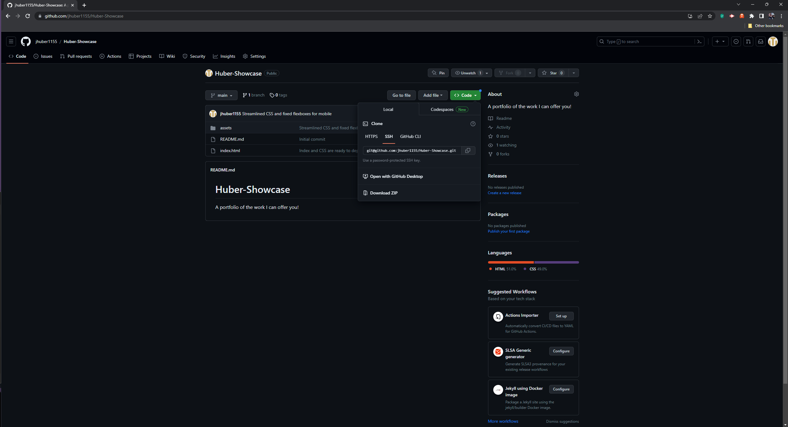
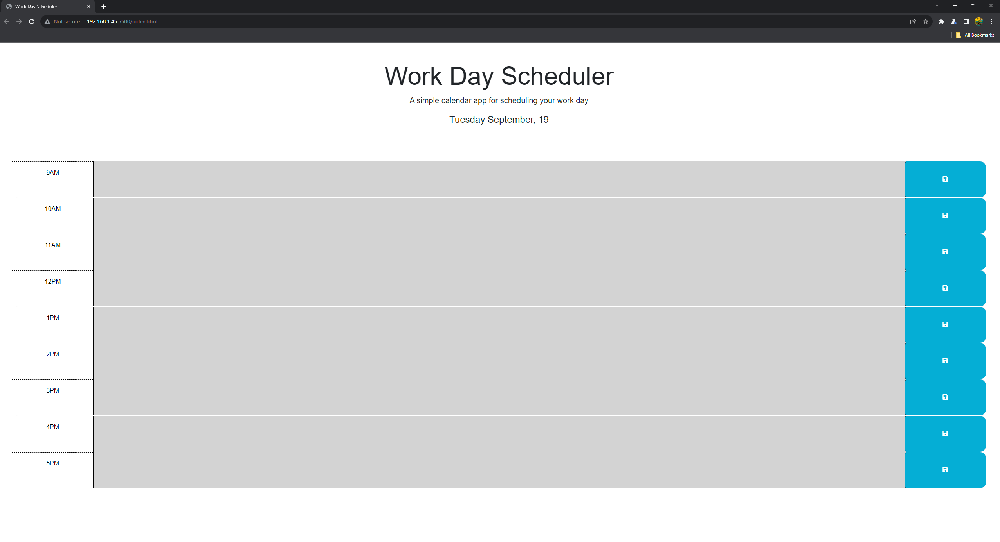

# Daily-Planner

## Description

This daily planner was created as a way of helping people stay organized with their daily tasks and allows them to modify their day as they go about their busy days. Time management is a vital pillar to a successful career and work/life management. This project will hopefully allow people to gain some agency over where and how their day is spent as well as help them plan for small breaks or giant projects, as the situation dictates.

I learned quite a bit about while working on this project. I had a difficult time grasping how to traverse the DOM, but with the help of my instructors, I was able to understand how to grab elements from the HTML and manipulate them in the corresponding Javascript. I also reinforced my learning on how to create arrays with for loops and then navigate those for loops with the data located within them and then grab the appropriate values which I needed to make the planner change as time itself marched ever forward.

Another thing I learned was how I could effectively incorporate dayjs into a website and then manipulate my Javascript elements to display different data from the same continuous clock. 

Another new technique I learned was that of a string literal to help me pull the number I needed from a value and apply it to the #id I was trying to reference in HTML.

## Usage

In order to use this Daily Planner, you must first download the code from github pages.

[Github Pages](www.github.com)

Click on the green code button and then copy with HTTPS or SSH key

Clone the repository onto your computer using Git Bash or its equivalent.

Using Git Bash or its equivalent find the repository and open with code . .

From there, select the index.html and open with the Live Server extension or its equivalent.

You should be greeted with the following image:

The background color will change depending on the time of day. Your daily tasks will go into the colored background section and you can click on the save icon on the right (the disk button with the blue background).

A deployed version of this website can be found at:
https://jhuber1155.github.io/Daily-Planner

## Credits

I would like to credit my Instructor and Teaching Assistant for all the invaluable help they continue to provide me, as well as the students in my UCLA Coding Bootcamp class!

Other resources which I drew from to help me with this project include:

User:Quentin Stack Overflow:https://stackoverflow.com/questions/6860213/how-can-i-use-setattribute-to-set-multiple-classes-on-an-element

[w3schools](https://www.w3schools.com/)

[MDN Web Docs](https://developer.mozilla.org/en-US/)